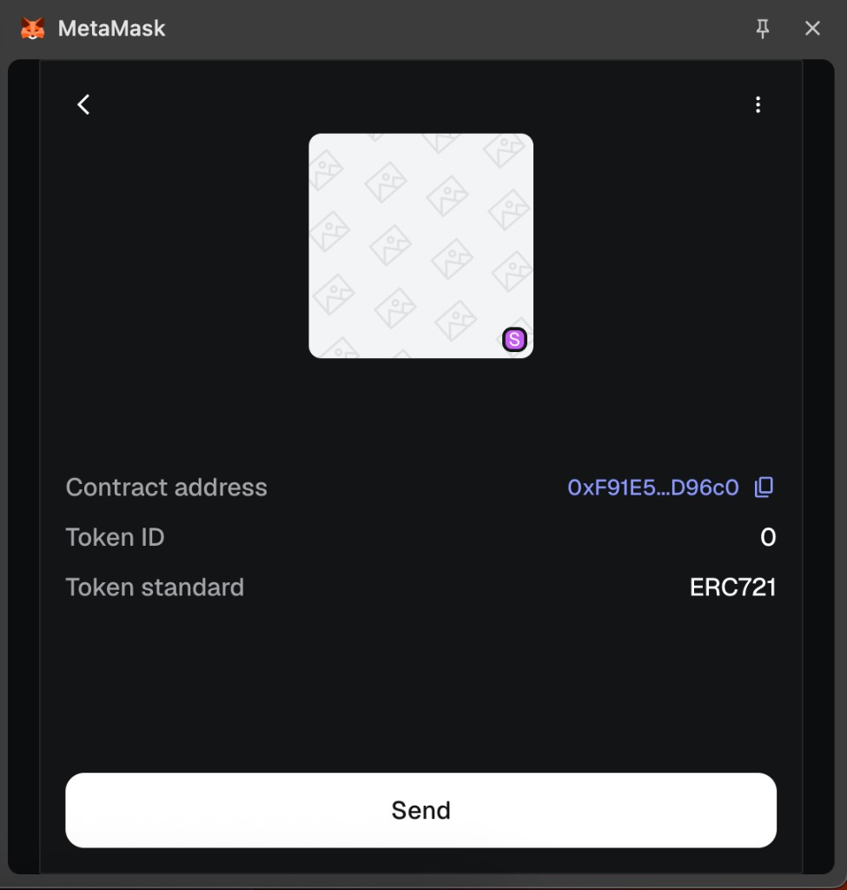
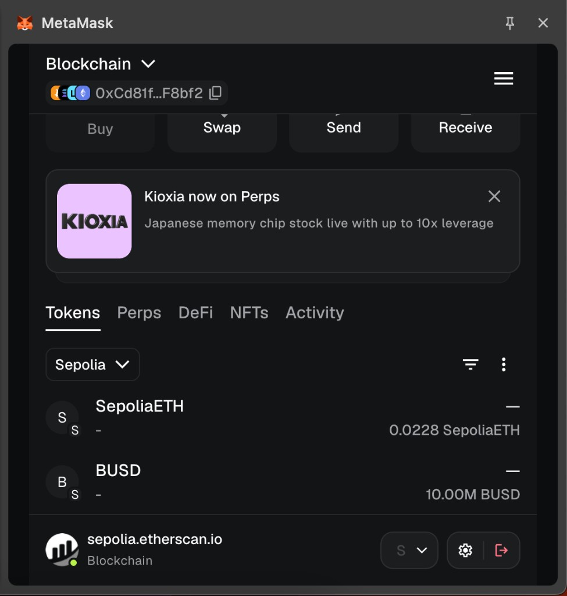

# Blockchain: Proyecto Final 
# CryptoCampo NFT

Sistema de NFTs sobre Ethereum (testnet **Sepolia**) que funciona como una mini economía:
un token ERC-20 propio (**BUSD**) se usa como moneda para comprar, vender, intercambiar y
reclamar NFTs (**CCNFT**, estándar ERC-721) que tokenizan bienes agrícolas.

## Contratos

- **BUSD** (`src/BUSD.sol`): token ERC-20 que actúa como moneda de cambio del sistema.
  En el deploy se mintean 10.000.000 BUSD al deployer.
- **CCNFT** (`src/CCNFT.sol`): contrato ERC-721 con la lógica económica. Cada NFT tiene un
  valor asociado y el contrato permite:
  - `buy`: comprar NFTs pagando con BUSD (más una tarifa de compra).
  - `putOnSale` / `trade`: poner un NFT en venta e intercambiarlo entre usuarios.
  - `claim`: reclamar NFTs para recuperar los fondos (con un porcentaje de beneficio).
  - Setters administrativos (`onlyOwner`) para configurar tarifas, valores válidos,
    colectores de fondos/tarifas y los flags `canBuy` / `canTrade` / `canClaim`.
  - Protección contra reentrancy (`ReentrancyGuard`) y transferencias directas
    deshabilitadas para forzar el flujo a través de `trade`.

## Despliegue en Sepolia

| Contrato | Dirección | Etherscan |
|---|---|---|
| **BUSD** | `0xA073c37D96a375fd176144b9D248b06966ca0d8C` | [Ver contrato](https://sepolia.etherscan.io/address/0xA073c37D96a375fd176144b9D248b06966ca0d8C) |
| **CCNFT** | `0xF91E56dCb0F0229FA12C29b50D4fB70cB76D96c0` | [Ver contrato](https://sepolia.etherscan.io/address/0xF91E56dCb0F0229FA12C29b50D4fB70cB76D96c0) |

Ambos contratos están **verificados** en Etherscan (código fuente público).

- **Owner / deployer:** `0xCd81faf98327B03bd9f783538414fA0400FF8bf2`
- **Tx de despliegue BUSD:** [`0xe1edfe4f...59db6742`](https://sepolia.etherscan.io/tx/0xe1edfe4f2c3812c97fd54fd01656294aa015a8b0488190e7dd09956059db6742)
- **Tx de despliegue CCNFT:** [`0x686e52c6...da845c53`](https://sepolia.etherscan.io/tx/0x686e52c6cbdcf2b85600aacbbe7524bd72e5401b45112281b8b8e014da845c53)

## Ejecutar la compra (`buy`) 

Para que `buy` funcione, hay que cumplir varias condiciones previas: aprobar el gasto de BUSD
y configurar los parámetros del contrato CCNFT. 

> **Nota sobre decimales:** BUSD tiene 18 decimales, así que los montos se expresan en su unidad
> mínima (wei). Por ejemplo, `1 BUSD = 1000000000000000000` (1 seguido de 18 ceros).

### 1. `approve` (en el contrato BUSD)

El contrato CCNFT necesita permiso para gastar los BUSD del comprador. Esto se hace en el
**contrato BUSD**, función `approve`:

| Parámetro | Valor |
|---|---|
| `spender` | `0xF91E56dCb0F0229FA12C29b50D4fB70cB76D96c0` (dirección del CCNFT) |
| `amount`  | `1000000000000000000` (lo necesario para comprar 1 NFT de valor 1 BUSD) |

> Conviene aprobar un monto mayor (p. ej. el total `10000000000000000000000000`) para no tener
> que repetir el `approve` en cada compra.

### 2. Seteos en el contrato CCNFT (solo el `owner`)

| Función | Parámetro | Valor | Propósito |
|---|---|---|---|
| `setFundsToken`     | `token`           | `0xA073c37D96a375fd176144b9D248b06966ca0d8C` | Define BUSD como moneda |
| `setFundsCollector` | `_address`        | `0xCd81faf98327B03bd9f783538414fA0400FF8bf2` | Recibe los fondos de las ventas |
| `setFeesCollector`  | `_address`        | `0xCd81faf98327B03bd9f783538414fA0400FF8bf2` | Recibe las tarifas |
| `setCanBuy`         | `_canBuy`         | `true`                                       | Habilita la compra |
| `addValidValues`    | `value`           | `1000000000000000000`                        | Marca 1 BUSD como valor válido de NFT |
| `setMaxBatchCount`  | `_maxBatchCount`  | `10`                                         | Máx. NFTs por operación |
| `setMaxValueToRaise`| `_maxValueToRaise`| `100000000000000000000000`                   | Tope total a recaudar |
| `setBuyFee`         | `_buyFee`         | `0`                                          | Tarifa de compra (0 = sin tarifa) |

### 3. `buy` (en el contrato CCNFT)

| Parámetro | Valor |
|---|---|
| `value`  | `1000000000000000000` (mismo valor marcado como válido) |
| `amount` | `1` |

Resultado: se minteó el **NFT tokenId 0** al comprador y se transfirieron los BUSD.

## Interactuar con el contrato en Etherscan

Como los contratos están verificados, se puede interactuar con cualquier función desde la web
de Sepolia Etherscan:

1. Entrar a la dirección del contrato en [sepolia.etherscan.io](https://sepolia.etherscan.io).
2. Pestaña **Contract** → tres sub-pestañas:
   - **Read Contract**: funciones de solo lectura (no cuestan gas). Sirven para consultar estado:
     `balanceOf`, `ownerOf`, `totalSupply`, `canBuy`, `fundsToken`, etc. Completar los parámetros
     (si los pide) y presionar **Query**.
   - **Write Contract**: funciones que modifican el estado (cuestan gas y requieren wallet).
3. Para escribir: en **Write Contract** → **Connect to Web3** y conectar MetaMask (red Sepolia).
   - Las funciones `onlyOwner` (los `set...`) solo funcionan si esta conectado con la wallet owner.
4. Elegir la función, completar los parámetros y presionar **Write**. Confirmar la transacción en MetaMask.

**Recordatorios importantes:**

- Los montos de BUSD van con **18 decimales** (en wei).
- El `value` que pases a `buy` debe estar previamente habilitado con `addValidValues`.
- Antes de `buy` o `trade`, necesitamos `approve` suficiente en el contrato BUSD.
- Para ejecutar `trade`/`putOnSale` el flag `canTrade` debe estar en `true`; para `claim`, `canClaim`.

## Capturas (MetaMask, red Sepolia)

NFT CCNFT importado (tokenId 0, ERC-721):



Tokens BUSD importados (10.000.000 BUSD):



## Comandos

```shell
# Compilar
forge build

# Tests
forge test

# Formato
forge fmt

# Deploy + verificación (requiere variables en .env)
make deploy-busd
make deploy-ccnft
```

### Variables de entorno (`.env`)

```
SEPOLIA_RPC_URL=...
PRIVATE_KEY=0x...
API_KEY_ETHERSCAN=...
```

## Stack

- [Foundry](https://book.getfoundry.sh/) (Forge, Cast)
- OpenZeppelin Contracts v4.5.0
- Solidity ^0.8.19
